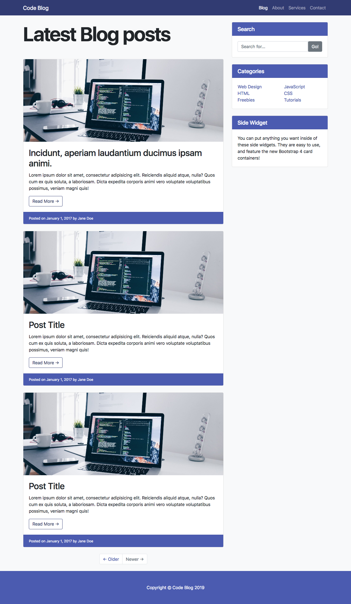
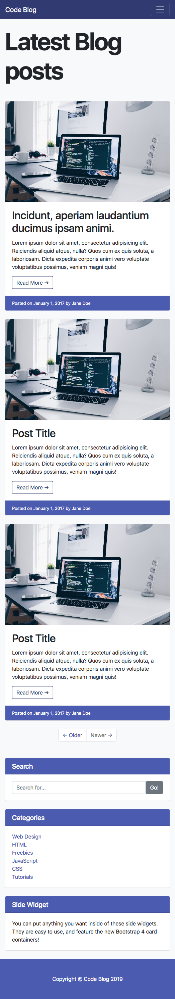
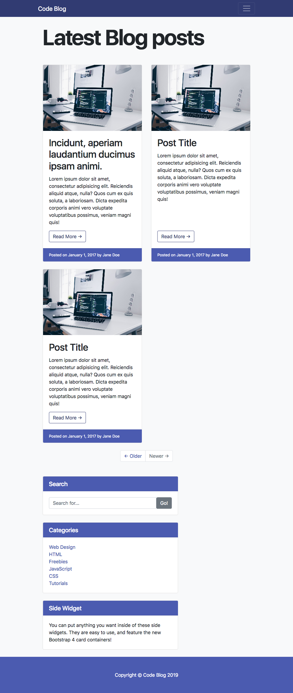
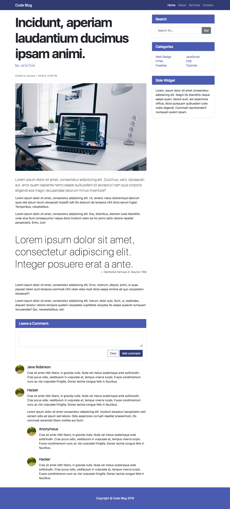
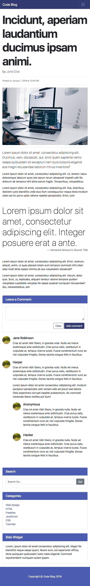
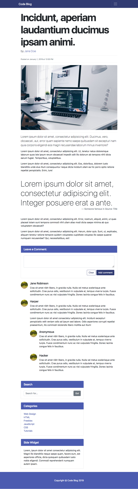

### Bootstrap Code Blog

---

For this project we're going to build a blog entirely with Bootstrap.

This will consist of two pages -

- A **blog list** -

  

###### (desktop)

---

###### (mobile)

---

###### (tablet)

---

- And a **blog page**

  

###### (desktop)

---

###### (mobile)

---

###### (tablet)

---

- You should have two `html` documents in the project - one for the list and one for the page

- When the user clicks on the _read more_ button they will be directed to the **blog page**

- Both pages will be fully responsive and correspond exactly to the reference images for desktop, mobile and tablet
